# Deployment Guide

This project automatically deploys to **Google Cloud Run** when changes are pushed to the `main` branch, but only after passing all tests in the CI pipeline.

## 🛠️ Deployment Stack

| Component | Tool / Platform | Purpose |
| :--- | :--- | :--- |
| **Source Control** | **GitHub** | Stores code and triggers pipelines. |
| **CI/CD** | **GitHub Actions** | Orchestrates testing, building, and deployment. |
| **Containerization** | **Docker** | Packages the Next.js app into a portable image. |
| **Registry** | **Google Container Registry (GCR)** | Stores the private Docker images. |
| **Hosting** | **Google Cloud Run** | Runs the serverless containers (auto-scaling). |

## 🔄 End-to-End Pipeline

```mermaid
graph LR
    A[🧑‍💻 Developer] -->|Push Code| B[GitHub Repo]
    B -->|Trigger| C{GitHub Actions}
    
    subgraph CI [Continuous Integration]
        C -->|1. Test| D[Lint & Type Check]
        D -->|2. Test| E[Unit Tests]
    end
    
    subgraph CD [Continuous Deployment]
        E -->|Pass| F[docker build]
        F -->|Image| G[Google Container Registry]
        G -->|Deploy| H[Google Cloud Run]
    end
    
    H -->|Live URL| I[🌍 sketch.ai]
    E -.->|Fail| J[❌ Stop & Notify]
```



## 🚀 CI/CD Pipeline Stages

We use GitHub Actions for our Continuous Integration and Continuous Deployment pipeline.

### Pipeline Stages

1.  **🧪 CI Stage (Pull Requests & Pushes)**
    *   **Linting:** Checks for code style issues (`npm run lint`).
    *   **Type Checking:** Verifies TypeScript types (`npx tsc --noEmit`).
    *   **Testing:** Runs unit tests (`npm test`).
    *   *If any step fails, the pipeline stops and deployment is blocked.*

2.  **🚀 CD Stage (Main Branch Only)**
    *   **Build:** Creates a production Docker image.
    *   **Push:** Uploads the image to Google Container Registry (GCR).
    *   **Deploy:** Updates the Cloud Run service with the new image.

## 🔑 Requirements

To facilitate deployment, the following secrets must be set in the GitHub Repository Settings:

| Secret Name | Description |
| :--- | :--- |
| `GCP_PROJECT_ID` | Your Google Cloud Project ID. |
| `GCP_SA_KEY` | JSON key for a Service Account with Cloud Run & GCR permissions. |
| `OPENAI_API_KEY` | Your OpenAI API Key (injected into the container). |

## 📦 Manual Deployment (Optional)

You can also build and deploy manually from your local machine if needed:

```bash
# Authenticate
gcloud auth login
gcloud config set project [YOUR_PROJECT_ID]

# Build
gcloud builds submit --tag gcr.io/[YOUR_PROJECT_ID]/sketch-ai

# Deploy
gcloud run deploy sketch-ai \
  --image gcr.io/[YOUR_PROJECT_ID]/sketch-ai \
  --platform managed \
  --region us-central1 \
  --allow-unauthenticated \
  --set-env-vars "OPENAI_API_KEY=sk-..."
```

## 🐳 Docker

The application is containerized using a multi-stage `Dockerfile` optimized for production:
*   **Deps Stage:** Installs dependencies.
*   **Builder Stage:** Builds the Next.js application.
*   **Runner Stage:** Minimal alpine image for running the app.
